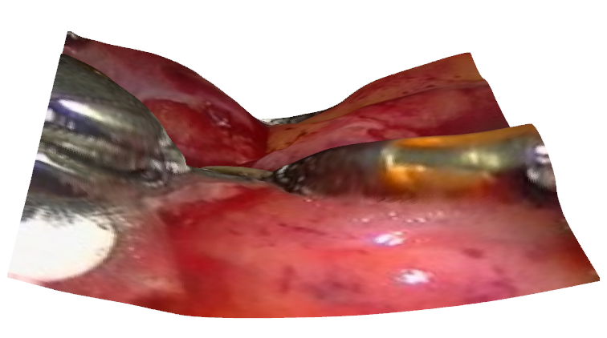

# [[ICAMCS2024]](https://icamcs2024.isvnu.vn/) 3D Reconstruction of Endoscopic Images using Depth Anything Model v2

This repository contains the implementation for "3D Reconstruction of Endoscopic Images using Depth Anything Model v2" (accepted at [ICAMCS 2024](https://icamcs2024.isvnu.vn/), paper ID 88).

## Overview

This project leverages the Depth Anything V2 model to generate accurate depth maps from endoscopic images, enabling 3D reconstruction of internal anatomical structures. Our approach provides a robust solution for medical visualization without requiring specialized hardware.

## Installation

```bash
# Clone the repository
git clone https://github.com/manhbd-22022602/3d-reconstruction.git
cd 3d-reconstruction

# Install dependencies
pip install -r requirements.txt
```

## Usage

### Single Image Reconstruction

Basic usage:
```bash
python examples/single_image_reconstruction.py --image_path "path/to/image.png"
```

Example with specific file:
```bash
python examples/single_image_reconstruction.py --image_path "image_inference/rec4_image.png"
```

### Example Output

When running the reconstruction script, you should see output similar to:
```
INFO:__main__:Initializing depth estimator...
INFO:__main__:Loading image...
INFO:__main__:Estimating depth...
INFO:__main__:Creating point cloud...
INFO:__main__:Saving point cloud to output/rec4_image_pointcloud.ply
INFO:__main__:Processing complete. Results saved to output/rec4_image_pointcloud.ply
```

## Results

The reconstruction pipeline outputs 3D point clouds that can be visualized using standard tools. Results are saved in PLY format in the specified output directory.



## Citation

If you find this work useful in your research, please consider citing our paper:

```bibtex
@inproceedings{kim2024reconstruction,
  title={3D Reconstruction of Endoscopic Images using Depth Anything Model v2},
  author={Kim Thai Dinh and Duc Manh Bui},
  booktitle={The International Conference on Applied Mathematics and Computer Science (ICAMCS)},
  year={2024}
}
```

## License

This project is licensed under the MIT License.

